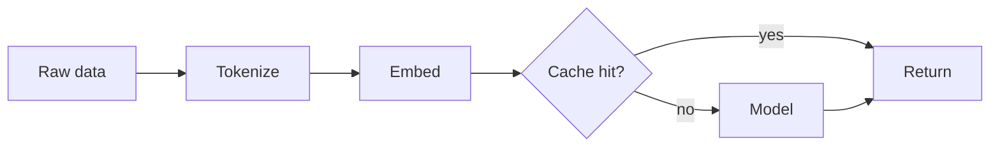

First entry. Notes on what I worked on, what tripped me up, and what I want
to try next.

## Code

```python
def softmax(x):
    e = np.exp(x - x.max())
    return e / e.sum()
```

## Math

Inline: \(e^{i\pi} + 1 = 0\).

Block:

$$
\mathcal{L} = -\frac{1}{N} \sum_{i=1}^{N} y_i \log \hat{y}_i
$$

## Diagram


